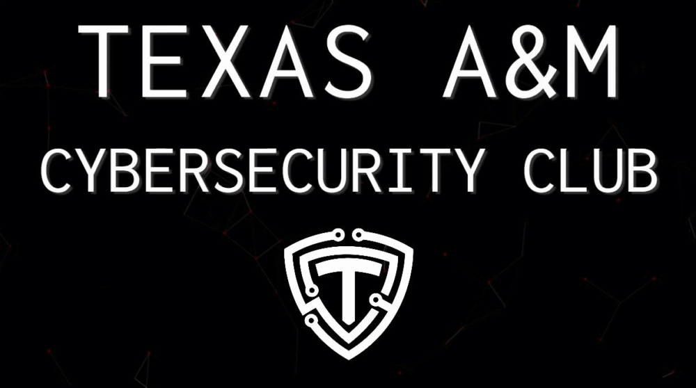

# The _Official_ Website for Texas A&amp;M Cybersecurity Club

# How to Deploy

We use AWS S3 Buckets to host the website. To deploy the latest build of the astro site to the bucket, you must do the following:

1. [Install the AWS CLI](https://docs.aws.amazon.com/cli/latest/userguide/getting-started-install.html)
2. [Configure your CLI](https://docs.aws.amazon.com/cli/latest/userguide/cli-authentication-user.html) using `aws configure` and feed it the credentials from the accessKeys.csv
3. [Deploy the build](https://docs.astro.build/en/guides/deploy/aws/#s3-static-website-hosting) using `aws s3 cp dist/ s3://cybr.club/ --recursive`

**OR**

-   If you've already configured everything and know it works, just run `npm run deploy`

# Archive

- Previously, the website was deployed using [CodePipeline from AWS](https://aws.amazon.com/codepipeline/) 